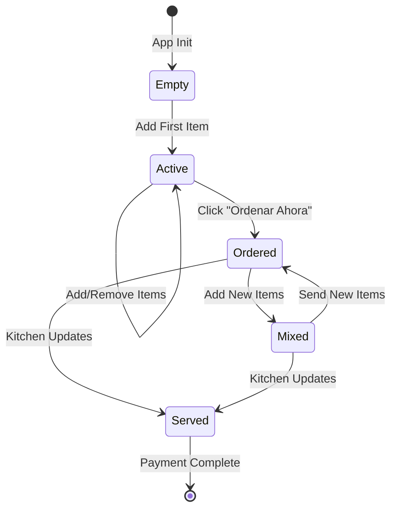

# 🍽️ SANBORNS DIGITAL MENU - DOCUMENTACIÓN COMPLETA

**📅 Última actualización:** 03 Julio 2025  
**🔖 Versión actual:** v1.2.3-beta  
**👨‍💻 Desarrollador:** Lodela  
**⏱️ Tiempo de lectura:** 15 minutos para dominar TODO el proyecto

> **🎯 PROPÓSITO DE ESTE DOCUMENTO:**  
> Si regresas en 2 meses y no recuerdas nada, leyendo esto en 15 minutos estarás 100% al día y podrás continuar desarrollando sin problemas.

---

## 📖 **ÍNDICE COMPLETO**

1. [¿QUÉ ES ESTA APP?](#qué-es-esta-app)
2. [¿CÓMO FUNCIONA?](#cómo-funciona)
3. [ARQUITECTURA TÉCNICA](#arquitectura-técnica)
4. [ESTRUCTURA DE ARCHIVOS](#estructura-de-archivos)
5. [FLUJO COMPLETO DE USUARIO](#flujo-completo-de-usuario)
6. [COMPONENTES PRINCIPALES](#componentes-principales)
7. [DATOS Y CONFIGURACIÓN](#datos-y-configuración)
8. [ESTADOS Y TRANSICIONES](#estados-y-transiciones)
9. [UI/UX DESIGN SYSTEM](#uiux-design-system)
10. [TESTING Y QA](#testing-y-qa)
11. [DEPLOYMENT](#deployment)
12. [ROADMAP FUTURO](#roadmap-futuro)

---

## 🎯 **¿QUÉ ES ESTA APP?**

### 🍽️ **Concepto Principal:**

**WebApp de menú digital para restaurantes** que reemplaza los menús físicos con una experiencia digital interactiva via QR.

### 🎨 **Estilo Visual:**

- **Tema:** Retro 90's con nostalgia
- **Colores:** Rojo "Checkit" (#dc3545) + Dorado + Blancos
- **Iconografía:** SVG masks personalizados + Font Awesome
- **Animaciones:** jQuery smooth transitions + CSS3

### 📱 **Dispositivos Objetivo:**

- **Primario:** Móviles (320px - 768px)
- **Secundario:** Tablets + Desktop (responsive)
- **PWA:** Instalable como app nativa

---

## 🔄 **¿CÓMO FUNCIONA?**

### 🎯 **Flujo Básico:**

```
1. Cliente llega al restaurante
2. Mesero escanea QR → Habilita mesa en sistema
3. Cliente escanea QR con su móvil
4. Abre webapp → Ve menú → Selecciona productos
5. Ordena → Cocina prepara → Mesero sirve
6. Cliente paga → Se va feliz
```

### 🍽️ **Proceso Detallado:**

#### **FASE 1: Inicialización (Backend)**

- Mesa se habilita en BD cuando mesero escanea QR
- Sistema asigna mesero específico
- Se registra número de comensales
- Se genera QR único para cliente

#### **FASE 2: Acceso Cliente**

- Cliente escanea QR → Abre webapp
- Ve splash screen con botones de entrada:
  - 🍽️ Comidas Sanborns
  - 🥐 Desayuno Sanborns
  - 📅 Menú del día
  - 📋 Menú Sanborns

#### **FASE 3: Navegación Menú**

- **TopNavbar:** Logo + Mesa info + Cart button + Hamburger
- **Content:** Búsqueda + 29 categorías + 150+ productos
- **BottomTab:** Menú | Mi Orden | Cuenta | Mesero

#### **FASE 4: Selección Productos**

- Cards con imagen, descripción, precio
- Click → Modal con detalles + cantidad
- "Agregar al carrito" → Badge counters se actualizan

#### **FASE 5: Mi Orden**

- TopNavbar se oculta (navegación limpia)
- Lista de productos seleccionados
- Controles cantidad, eliminar items
- Cálculo automático: subtotal + impuestos + total

#### **FASE 6: Proceso Orden**

- "Ordenar Ahora" → Items cambian a estado "enviado_cocina"
- Cocina prepara → Mesero actualiza a "servido"
- Cliente puede seguir agregando items nuevos

#### **FASE 7: Finalización**

- Items "servido" → Botones "Pagar Cuenta" + "Agregar Más"
- Proceso pago (futuro)
- Reset para siguiente cliente

---

## 🏗️ **ARQUITECTURA TÉCNICA**

### 📦 **Stack Tecnológico:**

#### **Frontend:**

```javascript
- HTML5: Semántico, accesible, PWA manifest
- CSS3: Bootstrap 5 Grid + Variables CSS + Flexbox/Grid
- JavaScript ES6+: Modules, async/await, destructuring
- jQuery 3.x: DOM manipulation, events, animations
```

#### **Backend Simulado:**

```javascript
- JSON Server: API REST simulada
- LocalStorage: Persistencia carrito
- SessionStorage: Estado temporal
- PWA: Service Worker + Cache
```

#### **Build & Deploy:**

```bash
- GitHub Pages: Hosting estático
- Live Server: Desarrollo local
- No build process: Vanilla JS directo
```

### 🧩 **Patrón Arquitectónico:**

#### **Modular Namespace Pattern:**

```javascript
// Cada módulo es un objeto literal con responsabilidad única
const MenuManager = {
  /* ... */
};
const CartManager = {
  /* ... */
};
const MobileTopNavbar = {
  /* ... */
};
```

#### **Principios SOLID:**

- **S**ingle Responsibility: Cada módulo una función
- **O**pen/Closed: Extensible sin modificar core
- **L**iskov Substitution: Interfaces consistentes
- **I**nterface Segregation: APIs específicas
- **D**ependency Inversion: Inyección de dependencias

#### **DRY (Don't Repeat Yourself):**

```javascript
// Utils centralizados
SanbornsUtils.log(), .formatPrice(), .debounce()

// Configuración centralizada
db.json → configuraciones globales

// Componentes reutilizables
ModalManager, StateService, DataService
```

---

## 📁 **ESTRUCTURA DE ARCHIVOS**

### 🗂️ **Organización Completa:**

```
📁 checkit/
│
├── 📄 index.html                    # Entry point - SPA
├── 📄 manifest.json                 # PWA configuration
├── 📄 sw.js                        # Service Worker
├── 📄 package.json                 # Dependencies
│
├── 📊 **DATA FILES**
├── 📄 db.json                      # Configuraciones + estados mesa
├── 📄 mock.json                    # Menú completo (29 cat, 150+ prod)
│
├── 📁 **ASSETS**
├── 📁 assets/
│   │
│   ├── 📁 **STYLES**
│   ├── 📁 css/
│   │   ├── main.css                # Estilos principales + variables
│   │   ├── mobile-navbar.css       # TopNavbar + botones fijos
│   │   ├── drawer-menu.css         # Hamburger menu sidebar
│   │   └── retro-animations.css    # Animaciones 90's
│   │
│   ├── 📁 **SCRIPTS**
│   ├── 📁 js/
│   │   ├── 📄 **CORE**
│   │   ├── app.js                  # Aplicación principal + navegación
│   │   ├── constants.js            # Constantes globales
│   │   ├── utils.js                # Utilidades + debugging
│   │   │
│   │   ├── 📄 **COMPONENTS**
│   │   ├── menu.js                 # MenuManager - renderizado
│   │   ├── cart.js                 # CartManager - carrito + estados
│   │   ├── mobile-navbar.js        # TopNavbar configurable
│   │   ├── drawer-menu.js          # Hamburger menu
│   │   │
│   │   └── 📁 **SERVICES**
│   │       ├── data-service.js     # Abstracción API
│   │       ├── config-service.js   # Configuraciones
│   │       ├── state-service.js    # Estado global
│   │       ├── cart-manager.js     # Lógica carrito avanzada
│   │       ├── order-manager.js    # Gestión órdenes
│   │       └── navigation-service.js # Navegación SPA
│   │
│   └── 📁 **ASSETS**
│       ├── 📁 images/
│       │   ├── sanborns.svg        # Logo principal
│       │   ├── sanbornsWhite.svg   # Logo navbar
│       │   ├── cuenta.svg          # Icono Mi Orden
│       │   ├── check.svg           # Icono Cuenta
│       │   ├── waiter.svg          # Icono Mesero
│       │   ├── menuIcon.svg        # Icono Menú
│       │   └── icon-512.png        # PWA icons
│       │
│       └── 📁 sounds/ (futuro)
│           └── notification.mp3
│
├── 📁 **DOCUMENTATION**
├── 📁 docs/
│   ├── MI_ORDEN_Y_CUENTA.md       # Especificación secciones
│   ├── ARCHITECTURE.md            # Documentación arquitectura
│   └── API.md                     # Endpoints + schemas
│
├── 📁 **PROJECT MANAGEMENT**
├── PROJECT_ROADMAP.md             # Roadmap + historial
├── REFACTORING_STATUS.md          # Estado refactoring
├── README.md                      # Setup + overview
└── README_GITHUB_PAGES.md         # Deploy instructions
```

### 📋 **Responsabilidades por Archivo:**

#### **🎯 Core Files:**

- **`index.html`** → SPA shell, navbar, secciones, tab bar
- **`app.js`** → Init, navegación, eventos globales
- **`constants.js`** → Versión, configuraciones, constantes

#### **🛠️ Components:**

- **`menu.js`** → MenuManager: categorías, productos, búsqueda
- **`cart.js`** → CartManager: carrito, estados, cálculos
- **`mobile-navbar.js`** → TopNavbar: scroll, configuración
- **`drawer-menu.js`** → Sidebar: hamburger menu

#### **🔧 Services:**

- **`data-service.js`** → DataService: fetch, cache, error handling
- **`utils.js`** → SanbornsUtils: logging, formatters, helpers

#### **📊 Data:**

- **`db.json`** → Configuraciones, mesas, órdenes
- **`mock.json`** → Menú completo de Sanborns

---

## 🎮 **FLUJO COMPLETO DE USUARIO**

### 📱 **NAVEGACIÓN STEP-BY-STEP:**

#### **🚀 1. ENTRY POINT**

```html
<!-- Pantalla inicial con botonera -->
URL: https://lodela.github.io/webScrapperSbrnsHmns/ Estado: Mesa habilitada en
BD UI Components: - Background: Rojo Sanborns con logo - 4 Botones: Comidas |
Desayuno | Menú día | Menú Sanborns - Acción: Click cualquier botón →
showSection('menu')
```

#### **🍽️ 2. SECCIÓN MENÚ**

```javascript
// showSection('menu') ejecuta:
Estado: currentSection = 'menu'
TopNavbar: Visible con logo, mesa info, cart, hamburger
Content: Search bar + categorías + productos
BottomTab: Menú (active) | Mi Orden | Cuenta (disabled) | Mesero

// Eventos principales:
searchInput.keyup → MenuManager.filterProducts()
productCard.click → ModalManager.showProductModal()
addToCartBtn.click → CartManager.addToCart() → badges update
```

#### **🛒 3. AGREGAR PRODUCTOS**

```javascript
// Al hacer click en producto:
ProductModal.show() → {
    product: {data del mock.json},
    quantity: 1 (default),
    customizations: [] (futuro)
}

// Al confirmar:
CartManager.addToCart(product, quantity) → {
    cart.items.push({
        ...product,
        quantity: quantity,
        estado: "nuevo",        // Estado inicial
        timestamp: Date.now(),
        subtotal: price * quantity
    });

    // UI Updates:
    updateBadges();           // Top + bottom counters
    showToast('Agregado');    // Feedback visual
    modal.hide();             // Cerrar modal
}
```

#### **🧾 4. SECCIÓN MI ORDEN**

```javascript
// Acceso: Cart button click O tab Mi Orden click
showSection('mi-orden') → {
    // UI Changes:
    topNavbar.hide();                    // ❌ Ocultar navbar
    cartButton.hide();                   // ❌ Ocultar cart button

    // Content:
    section: '#cuenta-section',          // Reutiliza misma sección
    title: 'Mi Orden',                   // Título específico
    icon: 'cuenta-icon-mask',            // Icono cuenta.svg

    // Render:
    CartManager.renderCart('cards');     // Vista cards por defecto
}

// Funcionalidades disponibles:
// ✅ Cambiar cantidad items (solo estado "nuevo")
// ✅ Eliminar items
// ✅ Toggle vista: cards ↔ lista
// ✅ Ver totales en tiempo real
// ✅ Botón "Ordenar Ahora" (solo si hay items "nuevo")
// ✅ Botón "Ver Menú" (navegación)
```

#### **🚀 5. ORDENAR AHORA**

```javascript
// Click "Ordenar Ahora":
CartManager.sendOrder() → {
    // Cambiar estado de items:
    cart.items.forEach(item => {
        if (item.estado === "nuevo") {
            item.estado = "enviado_cocina";
            item.sentTimestamp = Date.now();
        }
    });

    // UI Updates:
    showSuccessMessage('🍳 Orden enviada a cocina!');
    hideButton('ordenar-ahora-btn');
    disableEditing();                    // Items no editables

    // Persistencia:
    localStorage.setItem('sanborns-cart', JSON.stringify(cart));
}
```

#### **👨‍🍳 6. PROCESO COCINA**

```javascript
// BACKEND: Mesero actualiza desde su panel
mesero.updateOrderStatus(orderId, "servido") → {
    // Base de datos:
    orden.estado = "servido";
    orden.servedTimestamp = Date.now();

    // Frontend sync (polling o websocket futuro):
    cart.items.forEach(item => {
        if (item.estado === "enviado_cocina") {
            item.estado = "servido";
        }
    });

    // UI Updates (en sección "Cuenta"):
    showButtons(['pagar-cuenta-btn', 'agregar-mas-btn']);
    showMessage('✅ Tu orden está lista!');
}
```

#### **💰 7. ESTADOS MIXTOS**

```javascript
// Usuario puede seguir agregando items:
Escenario: {
    items_servidos: [{estado: "servido"}],     // No editables
    items_cocina: [{estado: "enviado_cocina"}], // No editables
    items_nuevos: [{estado: "nuevo"}]          // Editables ✅
}

// UI Dinámica:
if (hasNewItems()) {
    showButton('ordenar-ahora-btn');    // Para items nuevos
}
if (hasServedItems()) {
    enableSection('cuenta');            // Habilitar tab Cuenta
}
```

---

## 🧩 **COMPONENTES PRINCIPALES**

### 📱 **1. SanbornsApp (app.js)**

#### **Responsabilidad:**

Core de la aplicación, navegación SPA, inicialización

#### **API Pública:**

```javascript
SanbornsApp = {
    // Estado
    currentSection: 'menu',
    isLoading: false,

    // Métodos principales
    init(),                           // Inicialización completa
    showSection(sectionName),         // Navegación SPA
    updateNavigation(section),        // Actualizar tabs activos

    // Event handlers
    setupEventListeners(),            // Eventos globales
    handleKeyboardShortcuts(event),   // Alt+M, Alt+C, etc.

    // Utilidades
    isIOS(),                         // Detección dispositivo
    handleNetworkError(),            // Gestión errores
}
```

#### **Flujo de Inicialización:**

```javascript
$(document).ready() → {
    1. SanbornsApp.init()
    2. └── MobileTopNavbar.init()
    3. └── CartManager.init()
    4. └── MenuManager.init()
    5. └── DrawerMenu.init()
    6. └── setupEventListeners()
    7. └── showSection('menu')        // Estado inicial
    8. └── registerServiceWorker()    // PWA
}
```

### 🍽️ **2. MenuManager (menu.js)**

#### **Responsabilidad:**

Renderizado del menú, categorías, productos, búsqueda

#### **API Pública:**

```javascript
MenuManager = {
    // Estado
    menuData: {},                     // Datos de mock.json
    filteredData: {},                 // Datos filtrados
    currentSearch: '',                // Término búsqueda actual

    // Métodos principales
    init(),                          // Cargar datos del menú
    loadMenuData(),                  // Fetch mock.json
    renderCategories(data),          // Render categorías
    renderProducts(categoryName),     // Render productos de categoría

    // Búsqueda
    filterProducts(searchTerm),      // Filtrar productos
    clearSearch(),                   // Limpiar búsqueda

    // Utilidades
    formatProductPrice(price),       // Formatear precios
    buildProductCard(product),       // HTML producto
}
```

#### **Estructura de Datos:**

```javascript
// mock.json structure:
{
    "categoria1": {
        "productos": [
            {
                "orderPrductName": "Producto 1",
                "description": "Descripción...",
                "price": 129.0,
                "discount": 10,
                "image": "https://...",
                "sku": "18330"
            }
        ]
    }
}
```

### 🛒 **3. CartManager (cart.js)**

#### **Responsabilidad:**

Gestión completa del carrito, estados de productos, cálculos

#### **API Pública:**

```javascript
CartManager = {
    // Estado
    cart: {
        items: [],
        subtotal: 0,
        tax: 0,
        total: 0,
        timestamp: Date.now()
    },

    // Métodos principales
    init(),                          // Inicializar carrito
    addToCart(product, quantity),    // Agregar producto
    removeFromCart(productId),       // Eliminar producto
    updateQuantity(productId, qty),  // Actualizar cantidad

    // Estados
    sendOrder(),                     // nuevo → enviado_cocina
    updateOrderStatus(status),       // Backend sync

    // Renderizado
    renderCart(viewType),            // 'cards' | 'list'
    calculateTotals(),               // Recalcular totales

    // Persistencia
    saveCart(),                      // localStorage
    loadCart(),                      // Cargar desde storage
}
```

#### **Estados de Productos:**

```javascript
// Ciclo de vida de un item:
"nuevo" → {
    editable: true,
    showInOrderButton: true,
    canDelete: true,
    canChangeQuantity: true
}

"enviado_cocina" → {
    editable: false,
    readonly: true,
    showStatusBadge: "🍳 En Cocina"
}

"servido" → {
    editable: false,
    readonly: true,
    showStatusBadge: "✅ Servido",
    enablePaymentActions: true
}
```

### 📱 **4. MobileTopNavbar (mobile-navbar.js)**

#### **Responsabilidad:**

Navbar superior configurable, scroll behavior, modales

#### **API Pública:**

```javascript
MobileTopNavbar = {
    // Estado
    isNavbarVisible: true,
    scrollControllerEnabled: true,
    cartItems: 0,
    mesaData: {},

    // Configuración
    loadConfig(),                    // Desde db.json
    applyConfig(),                   // Aplicar estilos

    // Scroll Controller
    setupScrollController(),         // Auto hide/show
    forceHideNavbar(),              // Ocultar manual
    forceShowNavbar(),              // Mostrar manual

    // Cart Management
    updateCartBadge(cartData),      // Actualizar contador
    goToCart(),                     // Navegación

    // Mesa Modal
    showMesaModal(),                // Info + calculadora propina
    updateMesaDataFromCart(),       // Sync datos

    // Reset
    performReset(),                 // Limpiar app completa
}
```

#### **Configuración (db.json):**

```json
{
  "configuraciones": {
    "topNavbar": {
      "colorFondo": "#dc3545",
      "logoImagen": "sanbornsWhite.svg",
      "scrollPixeles": 5,
      "animacionMs": 300,
      "alturaNavbar": 60,
      "mostrarHamburger": true
    }
  }
}
```

---

## 📊 **DATOS Y CONFIGURACIÓN**

### 🗃️ **Archivos de Datos:**

#### **📄 db.json - Configuración Central**

```json
{
    "configuraciones": {
        "app": {
            "version": "1.2.3-beta",
            "nombre": "Sanborns Digital Menu",
            "empresa": "Sanborns",
            "pais": "México"
        },
        "topNavbar": {
            "colorFondo": "#dc3545",
            "logoImagen": "sanbornsWhite.svg",
            "scrollPixeles": 5,
            "animacionMs": 300,
            "alturaNavbar": 60,
            "mostrarHamburger": true
        },
        "horarios": {
            "desayunos": {
                "startHour": 6,
                "endHour": 14,
                "enabled": true,
                "buttonText": "Desayuno Sanborns",
                "menuNode": "Paquetes desayunos"
            },
            "comidas": {
                "startHour": 13,
                "endHour": 17,
                "enabled": true,
                "buttonText": "Comidas Sanborns",
                "menuNode": "Especialidades Sanborns"
            }
        }
    },
    "mesas": [
        {
            "numero": 201,
            "personas": 2,
            "mesero": "JOSE LUIS BAENA LOPEZ",
            "estado": "ocupada",
            "qrCode": "QR_MESA_201_ABC123",
            "timestamp": "2025-07-03T10:30:00Z"
        }
    ],
    "ordenes": [
        {
            "id": "ORD_001",
            "mesa": 201,
            "items": [...],
            "estado": "enviado_cocina",
            "timestamp": "2025-07-03T11:00:00Z"
        }
    ]
}
```

#### **📄 mock.json - Menú Completo**

```json
{
  "Festival del Mollete y Molletzzas Sanborns": {
    "productos": [
      {
        "orderPrductName": "Molletes sanborns de quesirri",
        "description": "Con salsa mexicana bolillos con mantequilla, gratinados con queso y frijoles refritos 4 piezas",
        "price": 129.0,
        "discount": 10,
        "image": "https://tofuu.getjusto.com/orioneat-local/resized2/4RMDBx--S1s5gNYXQ1KLA6.webp",
        "sku": "18608"
      }
    ]
  }
  // ... 28 categorías más con 150+ productos
}
```

### 💾 **Persistencia:**

#### **LocalStorage:**

```javascript
// Carrito principal
'sanborns-cart': {
    items: [...],
    subtotal: 315.10,
    tax: 50.42,
    total: 365.52,
    timestamp: 1625308800000
}

// Preferencias usuario
'sanborns-user-preferences': {
    viewType: 'cards',          // 'cards' | 'list'
    lastSection: 'menu',
    notifications: true
}

// Estado de sesión
'sanborns-session': {
    mesa: 201,
    mesero: "JOSE LUIS BAENA LOPEZ",
    startTime: 1625308800000
}
```

#### **SessionStorage:**

```javascript
// Datos temporales
'sanborns-temp-order': {...}    // Orden temporal
'sanborns-modal-state': {...}   // Estado modales
```

---

## 🔄 **ESTADOS Y TRANSICIONES**

### 📊 **Estados de la Aplicación:**

#### **🎯 App Level States:**

```javascript
SanbornsApp.currentSection: 'menu' | 'mi-orden' | 'cuenta' | 'mesero'
SanbornsApp.isLoading: boolean
```

#### **🛒 Cart Level States:**

```javascript
CartManager.cart.status: 'empty' | 'active' | 'ordered' | 'served'

// Item Level States:
item.estado: 'nuevo' | 'enviado_cocina' | 'servido'
```

#### **📱 UI Level States:**

```javascript
TopNavbar.isVisible: boolean
TopNavbar.scrollControllerEnabled: boolean
Modal.isOpen: boolean
Search.isActive: boolean
```

### 🔄 **Máquina de Estados del Carrito:**



#### **Transiciones Detalladas:**

```javascript
// 1. Empty → Active
trigger: CartManager.addToCart()
condition: cart.items.length === 0
action: enableOrderButton(), updateBadges(), showCartButton()

// 2. Active → Ordered
trigger: sendOrder()
condition: hasItemsInState('nuevo')
action: changeItemsState('nuevo' → 'enviado_cocina'), hideOrderButton()

// 3. Ordered → Mixed
trigger: addToCart()
condition: hasItemsInState('enviado_cocina')
action: addNewItem(estado: 'nuevo'), showOrderButton()

// 4. Ordered/Mixed → Served
trigger: updateOrderStatus('servido')
condition: mesero.updateStatus()
action: changeItemsState('enviado_cocina' → 'servido'), enablePayment()
```

---

## 🎨 **UI/UX DESIGN SYSTEM**

### 🎨 **Color Palette:**

#### **Primary Colors:**

```css
:root {
  /* Sanborns Brand */
  --sanborns-red: #dc3545;
  --sanborns-red-dark: #c82333;
  --sanborns-red-light: #f8d7da;

  /* Complementary */
  --sanborns-gold: #ffc107;
  --sanborns-gold-dark: #e0a800;

  /* Neutral */
  --gray-100: #f8f9fa;
  --gray-200: #e9ecef;
  --gray-300: #dee2e6;
  --gray-800: #343a40;
  --gray-900: #212529;

  /* Semantic */
  --success: #28a745;
  --warning: #ffc107;
  --danger: #dc3545;
  --info: #17a2b8;
}
```

#### **Typography:**

```css
/* Font Stack */
font-family: -apple-system, BlinkMacSystemFont, "Segoe UI", Roboto,
             "Helvetica Neue", Arial, sans-serif;

/* Hierarchy */
h1: 2.5rem (40px) - Page titles
h2: 2rem (32px) - Section titles
h3: 1.75rem (28px) - Subsection titles
h4: 1.5rem (24px) - Card titles
h5: 1.25rem (20px) - Item titles
h6: 1rem (16px) - Labels
p: 1rem (16px) - Body text
small: 0.875rem (14px) - Helper text
```

### 📱 **Component Library:**

#### **🔘 Buttons:**

```css
/* Primary Action */
.btn-danger {
  background: var(--sanborns-red);
  border: var(--sanborns-red);
  color: white;
  border-radius: 25px; /* Pill shape */
  font-weight: 600;
}

/* Secondary Action */
.btn-outline-danger {
  border: 2px solid var(--sanborns-red);
  color: var(--sanborns-red);
  background: transparent;
}

/* Icon Buttons */
.btn-icon {
  width: 40px;
  height: 40px;
  border-radius: 6px;
  display: flex;
  align-items: center;
  justify-content: center;
}
```

#### **🍽️ Product Cards:**

```css
.product-card {
  border-radius: 12px;
  box-shadow: 0 2px 8px rgba(0, 0, 0, 0.1);
  transition: transform 0.2s ease;
  background: white;
  border: 1px solid var(--gray-200);
}

.product-card:hover {
  transform: translateY(-2px);
  box-shadow: 0 4px 16px rgba(0, 0, 0, 0.15);
}

.product-image {
  aspect-ratio: 1;
  border-radius: 12px 12px 0 0;
  object-fit: cover;
}
```

#### **🎭 SVG Icon System:**

```css
/* Mask-based icons para customización de color */
.menu-icon-mask {
  mask: url('assets/images/menuIcon.svg') center/contain no-repeat;
  background-color: currentColor;
  width: 24px;
  height: 24px;
}

.cuenta-icon-mask {
  mask: url('assets/images/cuenta.svg') center/contain no-repeat;
  background-color: currentColor;
}

.check-icon-mask {
  mask: url('assets/images/check.svg') center/contain no-repeat;
  background-color: currentColor;
}
```

### 📱 **Responsive Breakpoints:**

```css
/* Mobile First Approach */
/* xs: 0-575px (mobile) */
@media (max-width: 575px) {
  .mobile-only {
    display: block;
  }
  .desktop-only {
    display: none;
  }
}

/* sm: 576-767px (large mobile) */
@media (min-width: 576px) and (max-width: 767px) {
  .container {
    padding: 0 20px;
  }
}

/* md: 768-991px (tablet) */
@media (min-width: 768px) {
  .mobile-nav {
    display: none;
  }
  .desktop-nav {
    display: block;
  }
}

/* lg: 992-1199px (small desktop) */
@media (min-width: 992px) {
  .container {
    max-width: 960px;
  }
}

/* xl: 1200px+ (large desktop) */
@media (min-width: 1200px) {
  .container {
    max-width: 1140px;
  }
}
```

### 🎞️ **Animations:**

#### **Page Transitions:**

```css
/* Section fade in */
.section {
  opacity: 0;
  transform: translateY(20px);
  transition: all 0.3s ease;
}

.section.active {
  opacity: 1;
  transform: translateY(0);
}

/* Navbar scroll hide/show */
.mobile-top-navbar {
  transform: translateY(0);
  transition: transform 0.3s ease;
}

.mobile-top-navbar.hidden {
  transform: translateY(-100%);
}
```

#### **Interactive Feedback:**

```css
/* Button press */
.btn:active {
  transform: scale(0.98);
}

/* Card hover */
.card:hover {
  transform: translateY(-2px);
}

/* Toast notifications */
@keyframes slideInTop {
  from {
    transform: translateY(-100%);
    opacity: 0;
  }
  to {
    transform: translateY(0);
    opacity: 1;
  }
}
```

---

## 🧪 **TESTING Y QA**

### ✅ **Testing Checklist:**

#### **📱 Responsive Testing:**

```javascript
// Viewport sizes to test:
- iPhone SE (375x667)
- iPhone 12 (390x844)
- iPhone 12 Pro Max (428x926)
- Samsung Galaxy S20 (360x800)
- iPad (768x1024)
- Desktop (1920x1080)

// Features to verify:
✅ TopNavbar positioning
✅ Bottom tab bar visibility
✅ Product cards layout
✅ Modal responsiveness
✅ Text readability
✅ Touch targets (minimum 44px)
```

#### **🔄 Functional Testing:**

```javascript
// Core User Flows:
✅ Add product to cart → Badge updates
✅ Navigate between sections → State preserved
✅ Order process → Items change state
✅ Cart persistence → Page reload maintains data
✅ Search functionality → Results filter correctly
✅ Modal interactions → Open/close smoothly

// Edge Cases:
✅ Empty cart state
✅ Network offline
✅ Large quantity numbers
✅ Long product names
✅ No search results
```

#### **🚀 Performance Testing:**

```javascript
// Metrics to monitor:
- First Contentful Paint: < 1.5s
- Largest Contentful Paint: < 2.5s
- First Input Delay: < 100ms
- Cumulative Layout Shift: < 0.1

// Tools:
- Lighthouse (Chrome DevTools)
- WebPageTest.org
- GTmetrix
```

### 🐛 **Known Issues:**

#### **🔧 P0 - Critical:**

```javascript
// TopNavbar visibility in Mi Orden
Issue: TopNavbar remains visible despite forceHideNavbar()
Cause: Bootstrap classes d-block d-md-none override
Status: In progress
Fix: Use CSS classes instead of .hide()
```

#### **📱 P1 - High:**

```javascript
// Tab "Cuenta" disabled
Issue: Tab Cuenta permanently disabled
Cause: UX decision pending
Status: Awaiting specification
Fix: Define enablement conditions
```

#### **🎨 P2 - Medium:**

```javascript
// Product images loading
Issue: Some images fail to load
Cause: External CDN reliability
Status: Monitoring
Fix: Image fallback system
```

---

## 🚀 **DEPLOYMENT**

### 🌐 **GitHub Pages Setup:**

#### **📋 Current Deployment:**

```bash
# Repository
URL: https://github.com/lodela/webScrapperSbrnsHmns
Branch: main (auto-deploy)
Live URL: https://lodela.github.io/webScrapperSbrnsHmns/

# Build Process
Type: Static (no build required)
Files: Direct serve from root
Entry: index.html
```

#### **⚙️ Deploy Configuration:**

```javascript
// GitHub Pages Settings:
Source: Deploy from branch
Branch: main
Folder: / (root)
Custom domain: None (github.io subdomain)

// PWA Considerations:
Service Worker: ✅ Enabled
Manifest: ✅ Valid
HTTPS: ✅ Required for PWA
```

### 🔧 **Local Development:**

#### **📋 Setup Instructions:**

```bash
# 1. Clone repository
git clone https://github.com/lodela/webScrapperSbrnsHmns.git
cd webScrapperSbrnsHmns

# 2. Start local server
npx live-server
# OR
python -m http.server 8000
# OR
php -S localhost:8000

# 3. Access application
http://localhost:8000
```

#### **🛠️ Development Workflow:**

```bash
# 1. Create feature branch
git checkout -b feature/nueva-funcionalidad

# 2. Make changes
# Edit files directly (no build process)

# 3. Test locally
# Verify in multiple devices/browsers

# 4. Commit and push
git add .
git commit -m "feat: nueva funcionalidad"
git push origin feature/nueva-funcionalidad

# 5. Create PR
# GitHub → Create Pull Request → main

# 6. Auto-deploy
# Merge to main → GitHub Pages auto-deploys
```

### 📊 **Environment Configuration:**

```javascript
// Development
const ENV = 'development';
const API_BASE = './';
const DEBUG = true;

// Production (GitHub Pages)
const ENV = 'production';
const API_BASE = './';
const DEBUG = false;

// Configuration detection:
const isDevelopment = window.location.hostname === 'localhost';
const isProduction = window.location.hostname.includes('github.io');
```

---

## 🗺️ **ROADMAP FUTURO**

### 🎯 **FASE ACTUAL: v1.2.3-beta**

**Estado:** FUNCIONAL COMPLETO - Lista para usar  
**Completado:** 5 de 7 fases planificadas

### 🚧 **PRÓXIMAS FASES:**

#### **🔥 FASE 6: Fixes Críticos (1-2 semanas)**

```javascript
P0 - TopNavbar Hide Fix
├── Problema: Bootstrap override CSS
├── Solución: Custom CSS classes
└── Impact: UX crítico en Mi Orden

P1 - Botones Incorrectos
├── Problema: "Pagar Cuenta" en Mi Orden
├── Solución: Separar secciones correctamente
└── Impact: Confusión de usuario

P2 - Tab Cuenta Specification
├── Problema: Cuándo habilitar tab
├── Solución: Definir reglas de negocio
└── Impact: Flujo de usuario
```

#### **⚡ FASE 7: Enhanced UX (1 mes)**

```javascript
Drawer Menu Funcional
├── Contenido: Links navegación, configuración
├── Features: Info mesa, llamar mesero
└── UI: Animaciones smooth

PWA Optimizations
├── Service Worker: Cache offline avanzado
├── Install Prompt: Custom installation
└── Notifications: Push cuando orden lista

Performance
├── Lazy Loading: Imágenes productos
├── Code Splitting: Módulos bajo demanda
└── Bundle Size: Optimización archivos
```

#### **🔮 FASE 8: Módulos Avanzados (2-3 meses)**

```javascript
Sistema Meseros
├── Panel mesero: Gestión órdenes
├── Notificaciones: Órdenes nuevas
└── Estados: Cocina, servido, pagado

Pagos Integrados
├── Stripe/PayPal: Procesamiento
├── QR Payments: SPEI, CoDi
└── Split Bill: División cuenta

Personalización
├── Opciones productos: Sin cebolla, etc.
├── Alergenos: Información detallada
└── Favoritos: Productos frecuentes

Analytics
├── Métricas: Productos populares
├── Tiempos: Orden a cocina
└── Insights: Optimización menú
```

#### **🌟 FASE 9: AI & Automation (6+ meses)**

```javascript
Recomendaciones AI
├── ML: Productos sugeridos
├── Tiempo: Predicción preparación
└── Upselling: Cross-selling inteligente

Automation
├── Kitchen Display: Pantalla cocina
├── Inventory: Stock en tiempo real
└── Scheduling: Optimización mesas

Voice & AR
├── Voice Orders: Asistente voz
├── AR Menu: Realidad aumentada
└── Translation: Multi-idioma
```

### 📊 **Métricas de Éxito:**

#### **Technical KPIs:**

```javascript
Performance:
- Load Time: < 2s (target: 1s)
- PWA Score: > 90 (target: 95)
- Lighthouse: > 90 (target: 95)

Reliability:
- Uptime: > 99.5% (target: 99.9%)
- Error Rate: < 1% (target: 0.1%)
- Cart Loss: < 0.5% (target: 0.1%)
```

#### **Business KPIs:**

```javascript
User Experience:
- Order Completion: > 85% (target: 95%)
- Time to Order: < 3min (target: 2min)
- Return Usage: > 70% (target: 80%)

Operational:
- Order Accuracy: > 98% (target: 99%)
- Kitchen Efficiency: +20% (target: +30%)
- Paper Savings: 100% (achieved)
```

---

## 📞 **CONTACTO Y MANTENIMIENTO**

### 👥 **Team:**

- **Lead Developer:** Lodela
- **UX/UI:** Lodela
- **QA:** Lodela
- **DevOps:** GitHub Pages

### 📚 **Recursos:**

- **Repository:** https://github.com/lodela/webScrapperSbrnsHmns
- **Live App:** https://lodela.github.io/webScrapperSbrnsHmns/
- **Documentation:** /docs/ folder
- **Issues:** GitHub Issues tab

### 🔧 **Emergency Contacts:**

```javascript
// Critical Issues (P0):
Response Time: < 2 hours
Contact: GitHub Issues + immediate notification

// High Priority (P1):
Response Time: < 24 hours
Contact: GitHub Issues

// Medium/Low Priority (P2-P3):
Response Time: < 1 week
Contact: GitHub Issues
```

---

## 📝 **CONCLUSIÓN**

### ✅ **¿Qué tienes ahora?**

1. **WebApp completa y funcional** para menú digital Sanborns
2. **Arquitectura sólida** basada en principios SOLID + DRY
3. **Documentación completa** que explica todo el proyecto
4. **Roadmap claro** para futuras mejoras
5. **Sistema de deployment** automático en GitHub Pages

### 🎯 **Si regresas en 2 meses:**

1. **Lee este documento** (15 minutos) → Estarás 100% al día
2. **Revisa PROJECT_ROADMAP.md** → Estado actual del proyecto
3. **Checa GitHub Issues** → Problemas conocidos y progreso
4. **Ejecuta la app localmente** → Verifica que todo funciona
5. **Continúa desde donde dejaste** → Sin perder el hilo

### 🚀 **Próximos pasos recomendados:**

1. **Fix crítico TopNavbar** (P0)
2. **Especificar sección Cuenta** (UX decision)
3. **Completar Drawer Menu** (enhancement)
4. **Optimizar PWA** (performance)

---

**📅 Documento actualizado:** 03 Julio 2025  
**🎯 Estado:** Proyecto funcional y documentado completamente  
**✅ Ready for:** Desarrollo continuo y mantenimiento a largo plazo
